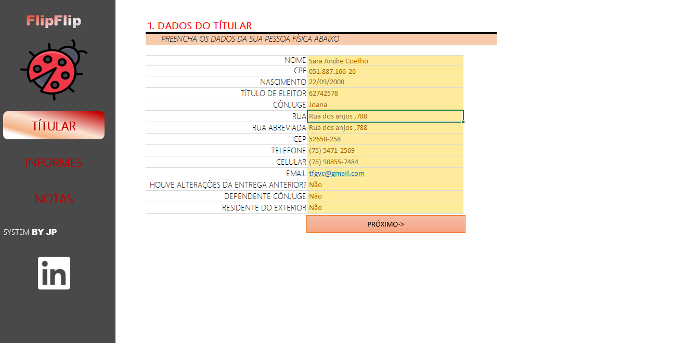
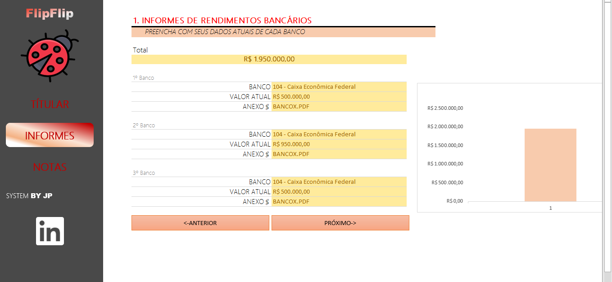
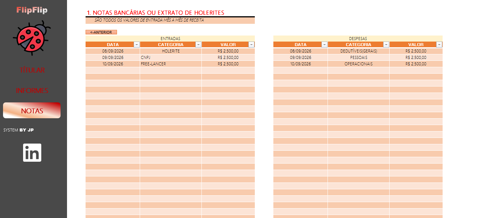

# 📚 Portfólio de Projetos - Excel com IA e Claude

## 📊 Projeto 1 — Simulador de Investimentos

## 📌 Sobre o projeto

Este projeto consiste no desenvolvimento de um Simulador de Investimentos criado no Microsoft Excel, com o objetivo de auxiliar o usuário no planejamento financeiro e na análise de diferentes cenários de investimento.

A ferramenta permite simular a evolução de um patrimônio a partir de informações como salário, valor do aporte mensal, período de investimento e taxa de rendimento mensal.

O projeto também apresenta uma sugestão de distribuição dos investimentos de acordo com o perfil do investidor, considerando diferentes categorias de Fundos de Investimento Imobiliário (FIIs).

---

## 🎯 Objetivo

O principal objetivo do projeto é demonstrar, de forma prática e visual, como diferentes valores de aportes, prazos e taxas de rendimento podem influenciar a formação de patrimônio ao longo do tempo.

A ferramenta foi desenvolvida como parte do curso **Santander - Excel com IA e Claude**.

---

## ⚙️ Funcionalidades

O simulador possui as seguintes funcionalidades:

- Definição do salário mensal;
- Cálculo de uma sugestão de investimento mensal;
- Definição do valor do aporte mensal;
- Definição do período de investimento;
- Definição da taxa de rendimento mensal;
- Cálculo do patrimônio acumulado;
- Estimativa de dividendos mensais;
- Simulação de diferentes cenários de investimento;
- Comparação de resultados em diferentes períodos;
- Classificação do perfil do investidor;
- Sugestão de distribuição dos investimentos entre diferentes tipos de FIIs;
- Apresentação visual dos resultados por meio de gráficos.

---

## 📈 Cenários de investimento

O simulador permite visualizar o patrimônio estimado em diferentes períodos:

- 2 anos;
- 5 anos;
- 10 anos;
- 20 anos;
- 30 anos.

Essa funcionalidade permite observar como o tempo de investimento pode influenciar o crescimento do patrimônio.

---

## 💰 Cálculo do investimento

O usuário pode informar:

| Informação | Descrição |
|---|---|
| Salário | Renda mensal utilizada como referência |
| Aporte mensal | Valor destinado aos investimentos |
| Período | Quantidade de anos do investimento |
| Taxa de rendimento | Rentabilidade mensal utilizada na simulação |
| Rendimento da carteira | Taxa utilizada para estimar os dividendos |

A partir dessas informações, o simulador calcula o patrimônio acumulado e uma estimativa de dividendos mensais.

---

## 👤 Perfil do investidor

O projeto também apresenta três perfis de investidor:

### 🟢 Conservador

Perfil que prioriza uma estratégia mais defensiva, com maior concentração em determinadas categorias de FIIs.

### 🟡 Moderado

Perfil intermediário, buscando equilíbrio entre diferentes categorias de investimentos.

### 🔴 Agressivo

Perfil que aceita maior exposição a diferentes categorias buscando uma estratégia potencialmente mais dinâmica.

---

## 🏢 Distribuição dos FIIs

A ferramenta trabalha com diferentes tipos de Fundos de Investimento Imobiliário:

- PAPEL;
- TIJOLO;
- HÍBRIDOS;
- FOFs;
- DESENVOLVIMENTO;
- HOTELARIAS.

A distribuição percentual é definida de acordo com o perfil selecionado pelo usuário.

---

## 🖥️ Demonstração

### Tela inicial


### Simulação


### Segunda tela de simulação


### Gráfico de resultados


### Visualização em tela cheia


---

## 🛠️ Ferramentas utilizadas
Microsoft Excel;
Fórmulas e funções financeiras;
Tabelas;
Gráficos;
Recursos de Inteligência Artificial;

---

## 👨‍💻 Autor

João Pedro

Projeto desenvolvido durante o curso:

Santander - Excel com IA e Claude

---

## 📂 Estrutura do projeto

```text
simulador-de-investimentos/
│
├── README.md
│
├── Simulador de Investimentos.xlsx
│
└── images/
    ├── banner.png
    ├── grafico.png
    ├── simulacao.png
    ├── simulacao2.png
    ├── tela_cheia.png
    ├── tela_inicial.png
    └── tela_inicial2.pn
```
---

# 📊 Projeto 2 — FlipFlip | Imposto de Renda

## 📌 Sobre o projeto

O FlipFlip é uma planilha desenvolvida no Microsoft Excel com o objetivo de organizar informações financeiras e facilitar o levantamento de dados necessários para a declaração do Imposto de Renda.

A ferramenta reúne informações pessoais do titular, informes de rendimentos bancários, entradas financeiras e despesas, permitindo centralizar os dados em um único arquivo.

---

## 🎯 Objetivo

O objetivo do projeto é facilitar a organização das informações financeiras utilizadas na preparação da declaração do Imposto de Renda, tornando o processo mais estruturado e permitindo uma visualização mais clara dos dados.

---

## ⚙️ Funcionalidades

A planilha possui diferentes áreas para organização das informações:

- 👤 Cadastro dos dados do titular;
- 🏦 Registro de informes de rendimentos bancários;
- 💰 Organização dos valores disponíveis em diferentes instituições financeiras;
- 📥 Registro de entradas financeiras;
- 📤 Registro de despesas;
- 📅 Organização das informações por data;
- 🗂️ Classificação das movimentações por categoria;
- 📊 Consolidação das informações financeiras;
- 📎 Organização de referências e documentos relacionados aos dados informados.

---

## 📑 Estrutura da planilha

O projeto é dividido em diferentes abas para facilitar a organização das informações.

### 👤 TÍTULAR

Área destinada ao preenchimento dos dados pessoais do titular, como nome, CPF, data de nascimento, título de eleitor, cônjuge e endereço.

### 🏦 INFORMES

Área destinada ao registro dos informes de rendimentos bancários, permitindo informar diferentes instituições financeiras e seus respectivos valores.

### 📊 PLANILHA DE APOIO

Área utilizada como apoio para organização e seleção das instituições bancárias.

### 🧾 NOTAS

Área destinada ao registro das entradas e despesas financeiras, permitindo organizar informações por data, categoria e valor.

---

## 🖥️ Demonstração

### Dados do titular



### Informes de rendimentos



### Organização das informações financeiras



---

## 🛠️ Ferramentas utilizadas

- Microsoft Excel;
- Fórmulas e funções do Excel;
- Organização e validação de dados;
- Tabelas;
- Recursos de Inteligência Artificial;
- GitHub para documentação e organização do projeto.

---

## 🤖 Utilização de Inteligência Artificial

A Inteligência Artificial foi utilizada como ferramenta de apoio durante o desenvolvimento do projeto, auxiliando na organização das ideias, estruturação da solução, revisão das informações e documentação da atividade.

As informações e resultados foram analisados e validados durante o desenvolvimento da planilha.

---

## 📚 Aprendizados

O desenvolvimento do FlipFlip proporcionou a aplicação prática de conhecimentos relacionados à organização de dados no Excel, utilização de fórmulas, estruturação de planilhas e criação de uma ferramenta voltada para a organização financeira.

O projeto também permitiu compreender como o Excel pode ser utilizado para centralizar diferentes informações e tornar processos de organização financeira mais simples e estruturados.

Além disso, a atividade contribuiu para o desenvolvimento de conhecimentos relacionados à utilização de Inteligência Artificial como ferramenta de apoio na criação de soluções no Excel.

---

## ⚠️ Observação

Este projeto possui finalidade exclusivamente educacional e acadêmica.

A planilha tem como objetivo auxiliar na organização das informações e não substitui orientação de um profissional contábil ou fiscal.

---

## 📁 Arquivo do projeto

A planilha completa está disponível neste repositório:

**[FlipFlip.xlsx](FlipFlip.xlsx)**

---
